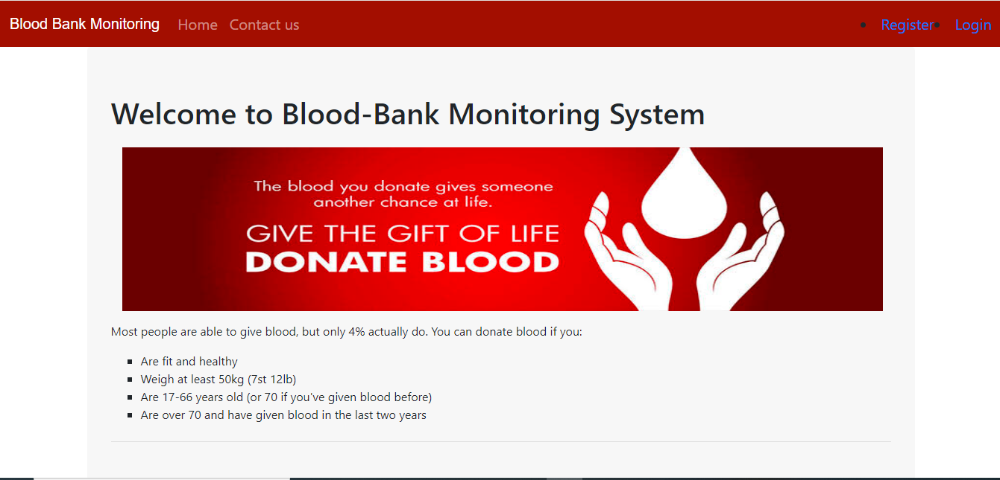
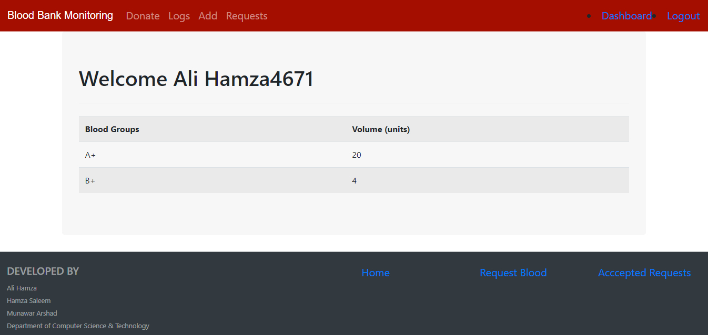
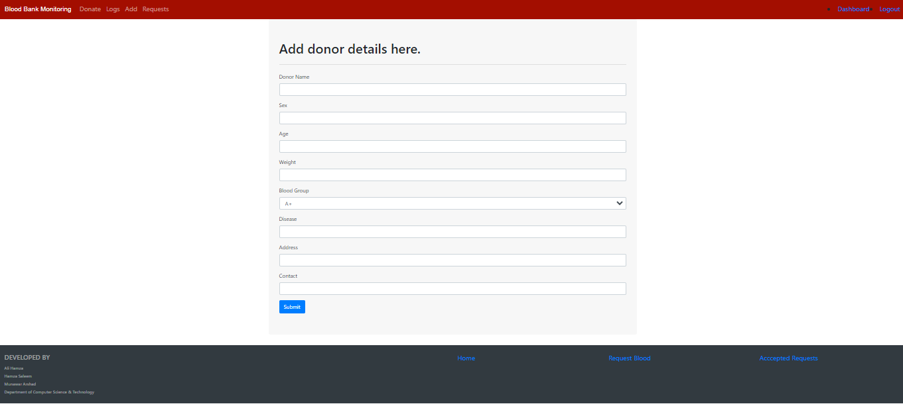
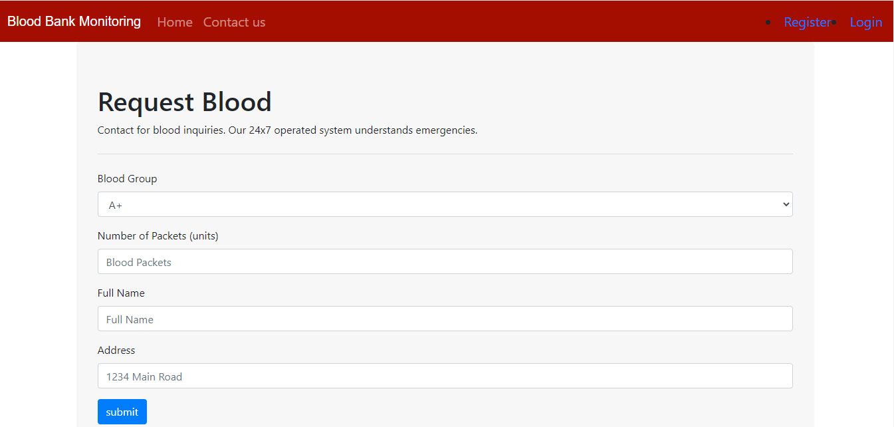
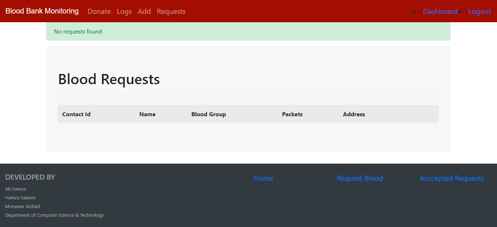

# Information Management System For A Blood Bank
Report Link: https://docs.google.com/document/d/1MZrnwYzGbihhWo9OdPqnqgWM3_yf3t5LY6qA_63C_xY/edit?usp=sharing
## Flask Commands:
Install Dependencies:
```
 pip install -r requirements.txt
```
Start the server:
```
export FLASK_APP='app.py'
```
Run the app:
```
flask run
```
## Database commands
### Open MySQL in terminal:
```
mysql -u root -p
```
If the above commands doesn't works then:
```
sudo mysql -u root -p
```
followed by updating the password using:
```
$ ALTER USER 'root'@'localhost' IDENTIFIED WITH mysql_native_password BY 'new-password';
```
Once this is done stop and start the mysql server:
```
$  sudo service mysql stop
$  sudo service mysql start
```


###Impot Dump
```
import the Dump files(.sql) in Dump folder
```
### View all databases:
```
SHOW DATABASES;
```
Creating a new database:
```
CREATE DATABASE bloodbank;
```
Use any database:
```
USE bloodbank;
```

## Snapshots
### Home Page

### Register

### Login

### Dashboard

### Add Donor

### Donor Logs

### Request Blood

### Blood Requests

### Accepted Requests
